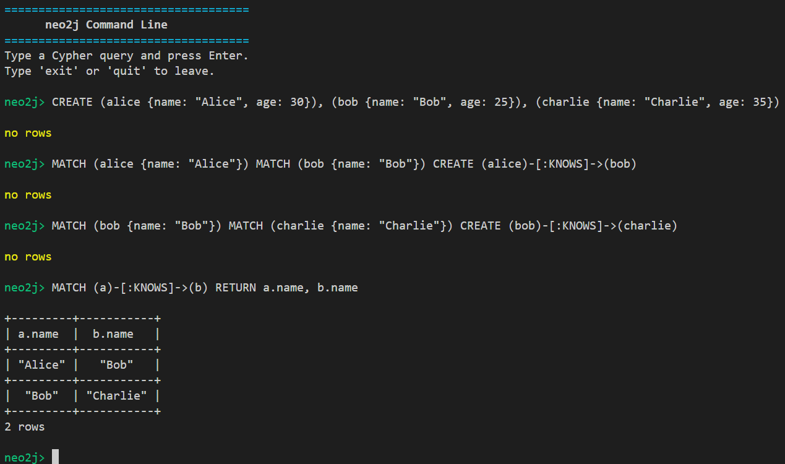
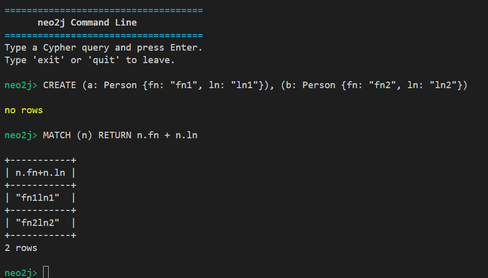

# Neo2j

### About
Neo2j is a toy clone of Neo4j, a popular graph database. It supports an essential subset of the Cypher5 query language. The main focus is the "frontend" functionality, ie parsing and generation of an execution plan.

### Run instructions
- make sure you are in the project root directory `neo2j`
- make sure you have a stable version of maven (version `3.9+`)

Build the application
```
mvn clean install
```
The CLI app is in the `app` folder, so run the command
```
mvn  exec:java -Dexec.mainClass="CLI" -pl app
```


### Features
- `MATCH`, `CREATE`, `DELETE`, `RETURN` clauses.

 NOTE: currently matching multiple patterns is not supported (for example `MATCH (n1:A), (n2:B)`)
- `Integer`, `String`, `Boolean` types + the common arithmetic functions
- `Node`, `Relationship`, `Path` return types

### Examples
#### simple example

#### string concatenation



### TODO
- semantic analysis checks
